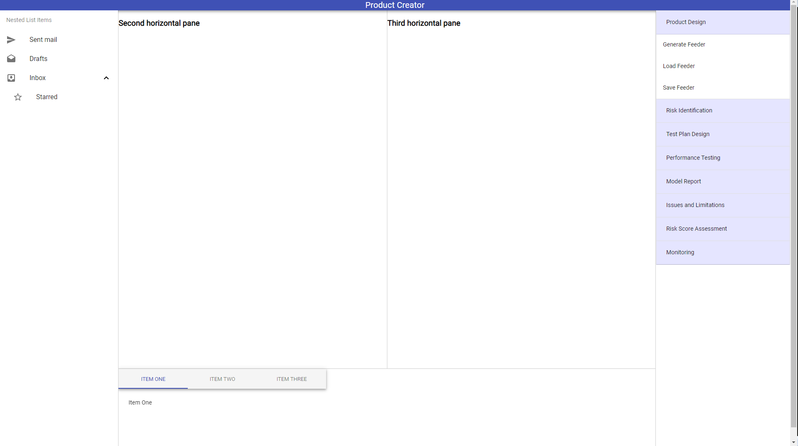

# Electron-React-apps

Packages to follow:

## react-simple/accordion-react

React app with tree components and accordions.

## splitpane-react

React app incorporating splitting panels.

## app_no_jquery

Electron app.

## my-app

Electron app incorporating React. Maybe we should check Reactron package.

## merging-react

React app including accordion, tree and splitting panels.

## react-tabs

React app including tabs.

## react-terminal

React app including terminal.

## file-editor

React app including file editors like React-ace and monaco-editor.

## monaco-editor-boilerplate

React app with the monaco editor incorporated. Could not make it work yet.

## css-gooey-menu-version-2

A simple css script that loads circle bubbles.

## react-databrowser

A react app with tables.

## react-table

A react app with tables.

## react-table-md

A react app with tables using material desing.

## material-ui

React app using a slider panel as base incorporating material ui desings from [here](https://github.com/mui-org/material-ui).

## monaco-editor-material-ui

React app using material ui components and integrating monaco editor.

## material-ui-tables

React app with material-ui incorporating tables as main window.

## react-drag

React app incorporating draggable items.

## material-ui-pop-up

React app incorporating material desing objects and a sliding window displaying the [Lucas Bebber's Gooey Menu](http://codepen.io/lbebber/pen/rawQKR).

## material-ui-window-small

React App incorporating material desing objects and a pop up window.

## material-ui-sign-in

React app incorporating material design objects with a sign in feature.

## pdf-viwer 

React app that incorporates a pdf viewer.

##  inherent-risk

React app that incorporates inherent risk score.

## model-risk

React app that incorporates model rsik score.

## directory-tree

React app that displays the current directory tree as a json file for a menu using [directory-tree](https://www.npmjs.com/package/directory-tree).

## material-ui-scroll

React app that incorporates long components and uses [scroll](https://material-ui.com/demos/dialogs/#scrolling-long-content).