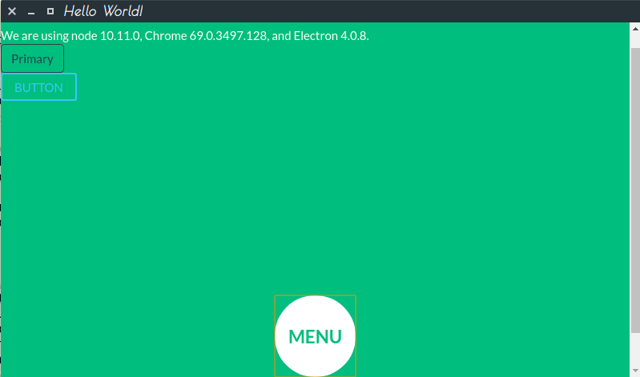
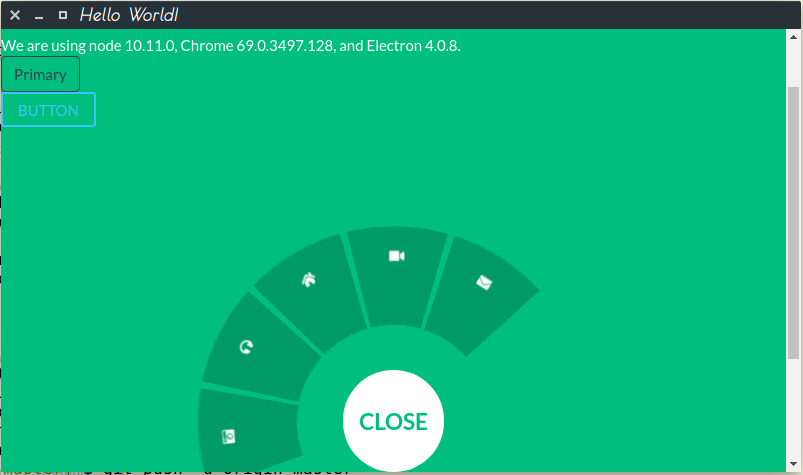

# Compiling resources used

* [Modernizr tutorial](https://www.lambdatest.com/blog/feature-detection-with-modernizr-for-cross-browser-compatibility/)

* [Theme](https://bootswatch.com/flatly/)

* [Buttons](https://saruwakakun.com/en/css3-buttons)

* [Circular navigations](https://tympanus.net/codrops/2013/08/09/building-a-circular-navigation-with-css-transforms/)

## Sample screens

